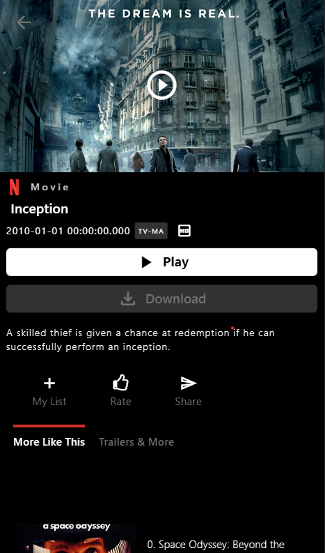

# Netflix Clone - Flutter App

## Description
The frontend component of a Netflix clone, built with Flutter. This app provides a user interface for browsing and streaming video content. It uses Firebase for authentication and BLoC for state management, ensuring a smooth user experience.

## Features
- **User Authentication**: Firebase authentication for user login and registration.
- **Video Streaming**: Browse Movies and Series content in multiple resolutions.
- **State Management**: Uses BLoC for efficient state management.

## Technologies Used
- Flutter
- Firebase Auth
- BLoC State Management

## Installation Instructions

1. **Clone the repository**:
   ```sh
   git clone https://github.com/Althaf-codes/Netflix-Clone-Flutter.git
   cd Netflix-Clone-Flutter

2. Install Flutter dependencies:
   ```sh
   flutter pub get

3. Set up Firebase:
   Follow the instructions from Firebase doc to add Firebase to your Flutter app:

4. Run the app:
   ```sh
   flutter run


## Screenshots





